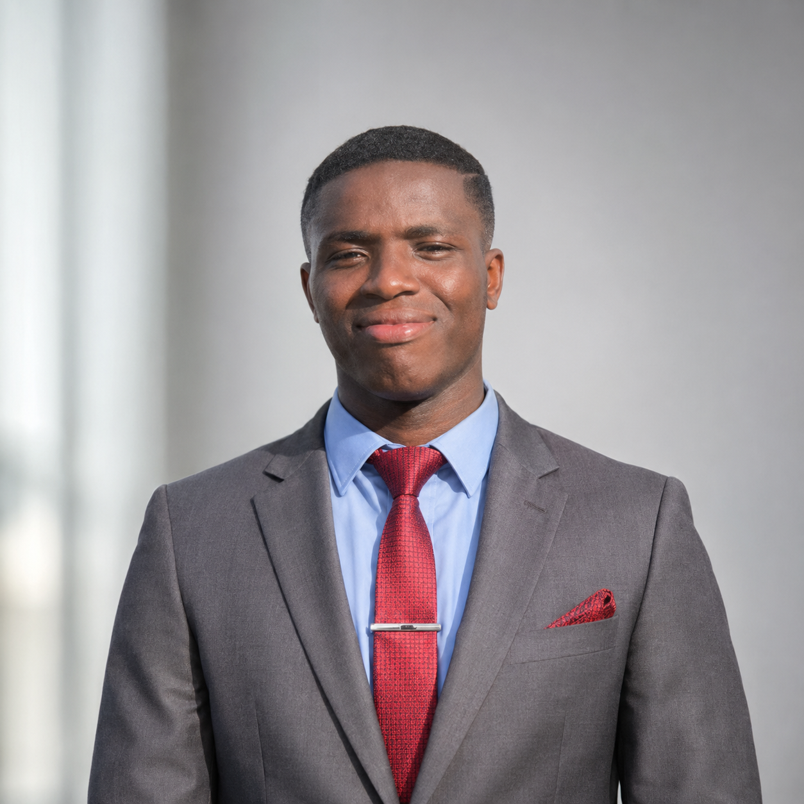
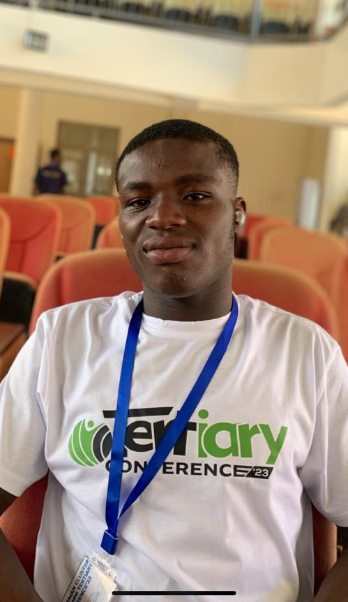

Fuseini Aboagye

Research and Teaching Assistant 
Department of Statistics and Actuarial Science 
University of Ghana 
 Accra, Ghana  

B.A. Economics & Statistics 
First Class Honours

 aboagyefuseini@gmail.com 

 [Google Scholar](https://scholar.google.com/citations?user=2NIQbBwAAAAJ&hl=en&oi=ao) 

 [ResearchGate](https://www.researchgate.net/profile/Fuseini-Aboagye?ev=hdr_xprf) 

 [LinkedIn](https://linkedin.com/in/fuseini-aboagye-8379aa237) 

 [GitHub](https://github.com/faboagye)

## About Me

Thank you for visiting my website!

I am **Fuseini Aboagye**, a Research and Teaching Assistant in the Department of Statistics and Actuarial Science at the [University of Ghana](https://www.ug.edu.gh/), where I earned my **B.A. double major in Economics and Statistics** with **First Class Honours (FGPA: 3.91)**. My undergraduate training integrated statistics and economics, providing me with a rigorous foundation in **statistical theory, econometrics, machine learning, biostatistics**, and **applied economics**, equipping me with the quantitative and analytical skills needed to investigate complex problems across healthcare, economics, and public policy.

During my undergraduate studies, I developed research experience across both statistics and economics. In statistics, my research focuses on understanding structural brain changes associated with Alzheimer's disease using longitudinal MRI data and statistical learning techniques. In economics, I examined the design and implementation of Multiple Indicator Cluster Surveys (MICS) and the role of population census questionnaires in evidence-based policymaking and national statistical planning. These experiences strengthened my interest in applying quantitative methods to address challenges in health, development, and economic policy.

Attending the 2023 Tertiary Conference organized by Compassion International Ghana, Mfantseman Cluster, themed <em>"Meeting the Challenges of the Next Decade."</em>

 

