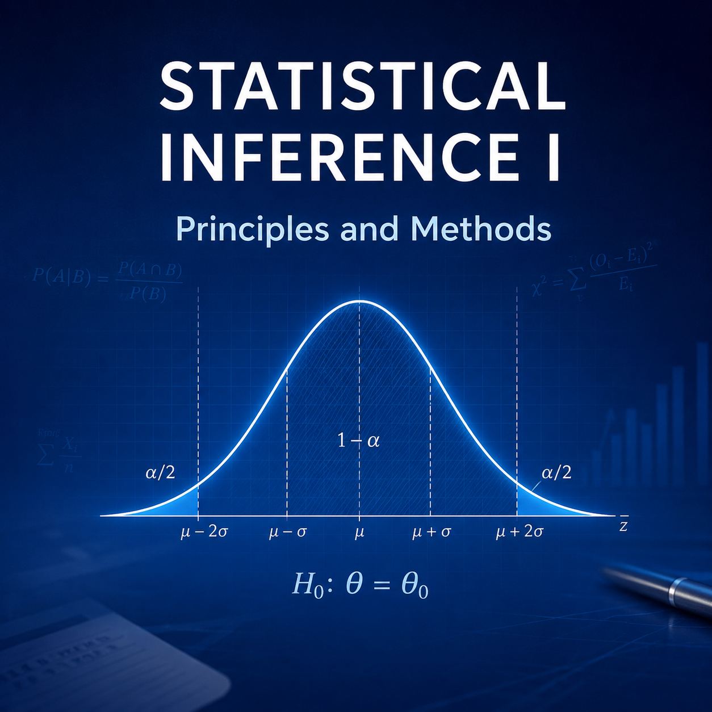
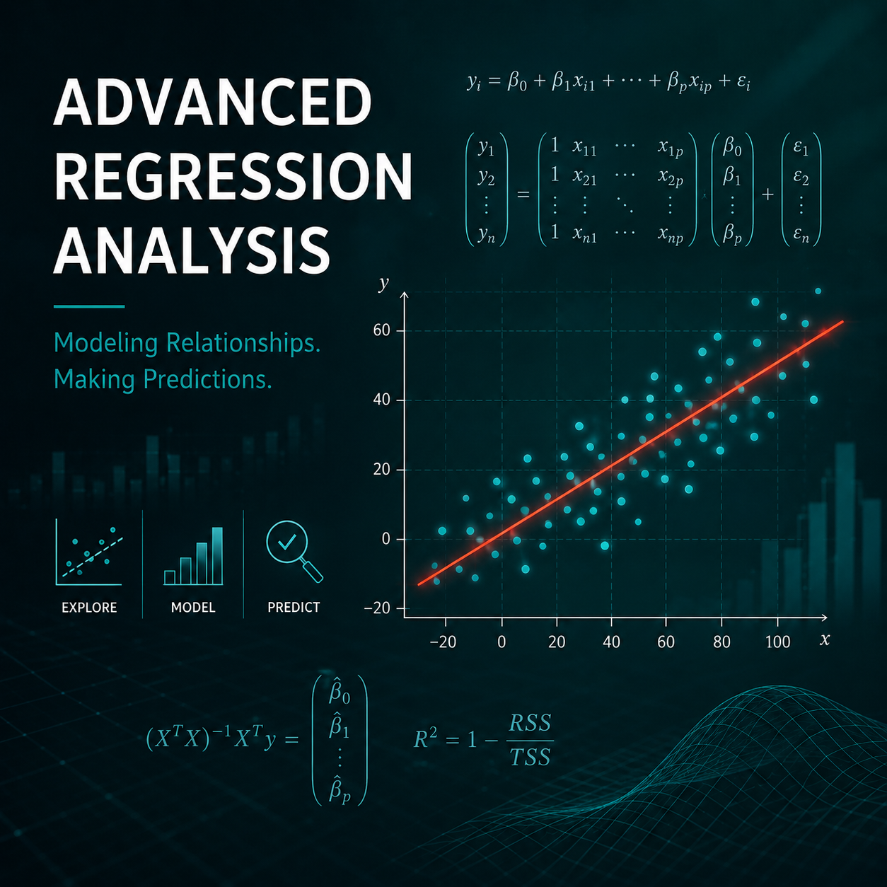
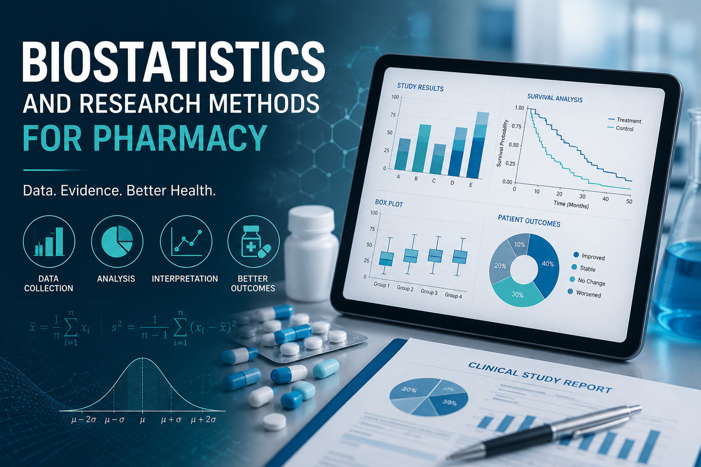
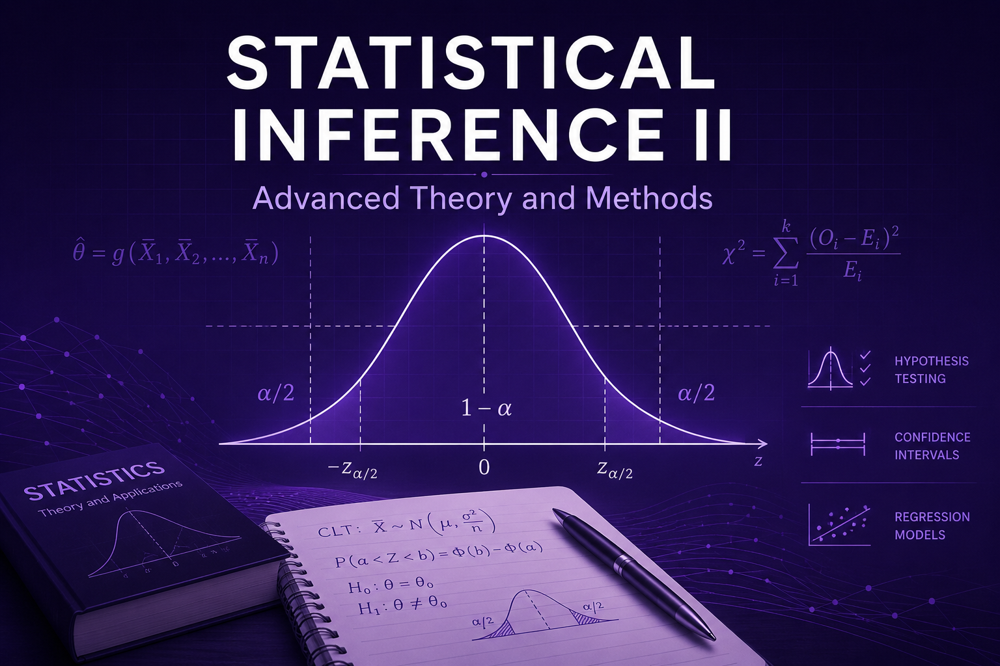
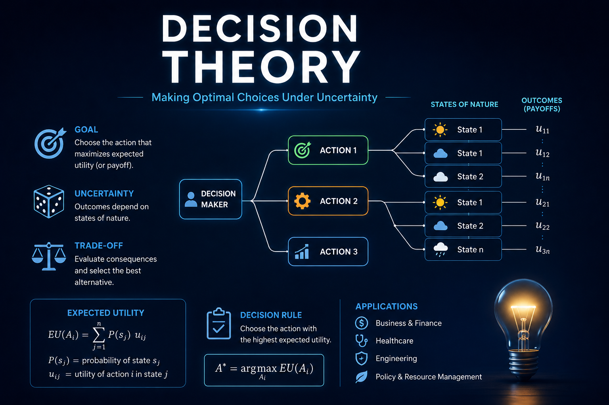
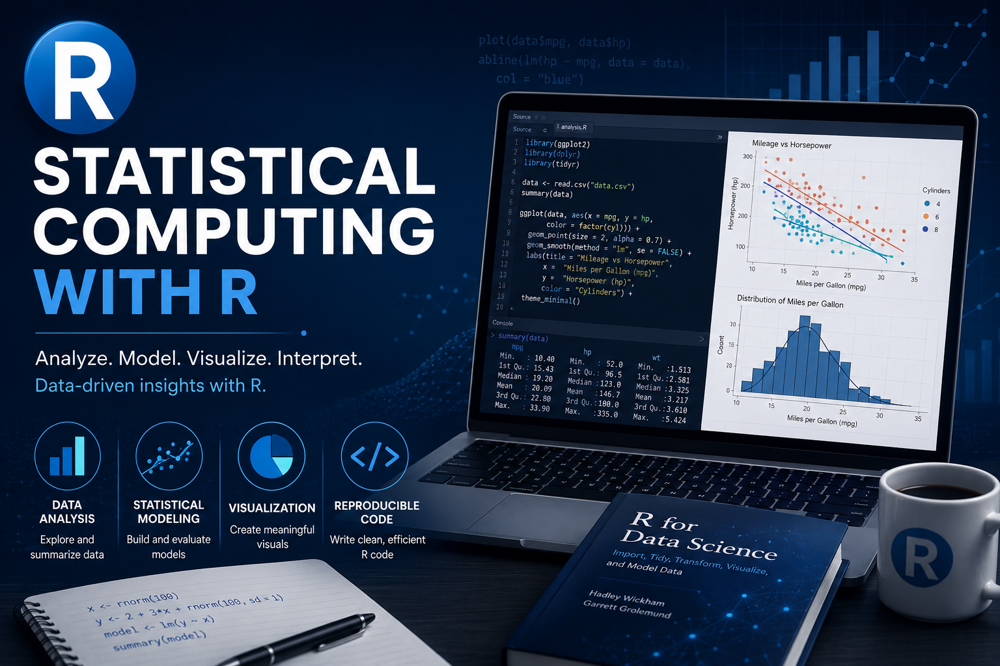

I currently serve as a **Teaching Assistant** in the **Department of Statistics and Actuarial Science, University of Ghana**. My responsibilities include facilitating tutorial sessions, assisting with practical classes, grading assignments and examinations, and providing academic support to undergraduate students. The courses I have assisted are listed below.

## First Semester, 2025/2026 Academic Year

::: {.grid}

::: {.g-col-12 .g-col-md-2}

{width=150}

:::

::: {.g-col-12 .g-col-md-10}

### [STAT 333: Statistical Inference I](https://www.ug.edu.gh/statistics/academics/undergraduate-courses){target="_blank"}

*Teaching Assistant*  
*Department of Statistics and Actuarial Science, University of Ghana*

Facilitated tutorial sessions, assisted with grading assignments and examinations, and supported undergraduate students in estimation, likelihood methods, confidence intervals, and statistical inference.

:::

:::

---

::: {.grid}

::: {.g-col-12 .g-col-md-2}

{width=150}

:::

::: {.g-col-12 .g-col-md-10}

### [STAT 445: Advanced Regression Analysis](https://www.ug.edu.gh/statistics/academics/undergraduate-courses){target="_blank"}

*Teaching Assistant*  
*Department of Statistics and Actuarial Science, University of Ghana*

Assisted students with multiple linear regression, regression diagnostics, model building, variable selection, interpretation of statistical models, and practical data analysis.

:::

:::

---

::: {.grid}

::: {.g-col-12 .g-col-md-2}

{width=150}

:::

::: {.g-col-12 .g-col-md-10}

### [PHMD 457: Biostatistics and Research Methods for Pharmacy](https://pharmacy.ug.edu.gh/academics/programmes){target="_blank"}

*Teaching Assistant*  
*Department of Pharmacy Practice and Clinical Pharmacy, University of Ghana*

Supported tutorials and practical sessions covering statistical methods for health research, study design, hypothesis testing, data analysis, and interpretation of pharmaceutical research findings.

:::

:::

## Second Semester, 2025/2026 Academic Year

::: {.grid}

::: {.g-col-12 .g-col-md-2}

{width=150}

:::

::: {.g-col-12 .g-col-md-10}

### [STAT 334: Statistical Inference II](https://www.ug.edu.gh/statistics/academics/undergraduate-courses){target="_blank"}

*Teaching Assistant*  
*Department of Statistics and Actuarial Science, University of Ghana*

Assisted students in advanced statistical inference, parametric and non-parametric methods in hypothesis testing, simple linear regression analysis.
:::

:::

---

::: {.grid}

::: {.g-col-12 .g-col-md-2}

{width=150}

:::

::: {.g-col-12 .g-col-md-10}

### [STAT 338: Decision Theory](https://www.ug.edu.gh/statistics/academics/undergraduate-courses){target="_blank"}

*Teaching Assistant*  
*Department of Statistics and Actuarial Science, University of Ghana*

Facilitated tutorials on Bayesian decision theory, loss functions, risk functions, admissibility, minimax procedures, and statistical decision-making.

:::

:::

---

::: {.grid}

::: {.g-col-12 .g-col-md-2}

{width=150}

:::

::: {.g-col-12 .g-col-md-10}

### [STAT 464: Statistical Computing with R](https://www.ug.edu.gh/statistics/academics/undergraduate-courses){target="_blank"}

*Teaching Assistant*  
*Department of Statistics and Actuarial Science, University of Ghana*

Guided undergraduate students in statistical programming using **R**, including data manipulation, visualization, simulation, statistical modelling, reproducible research, and computational methods for data analysis.

:::

:::